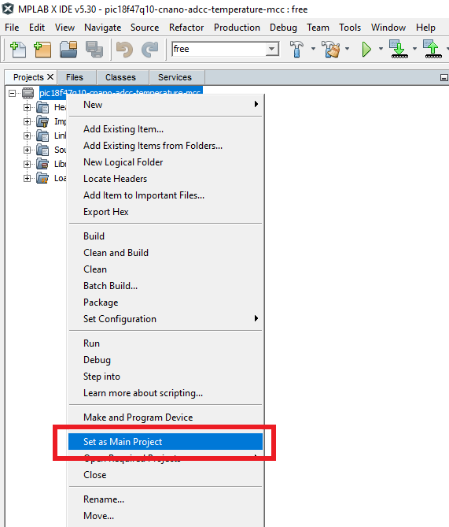
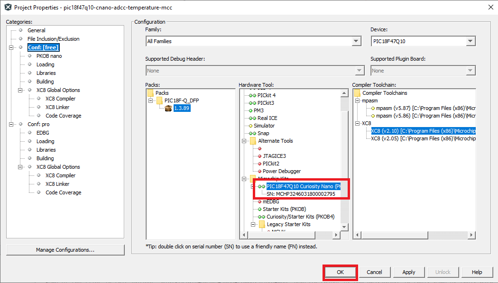
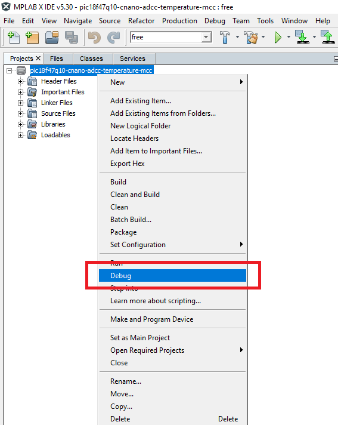
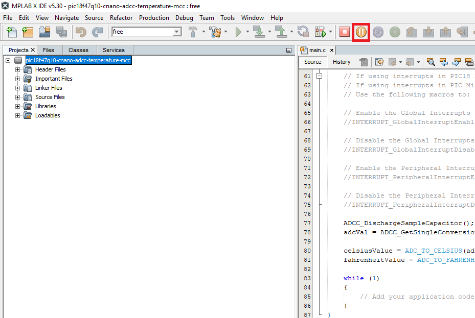
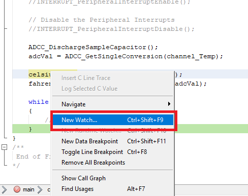
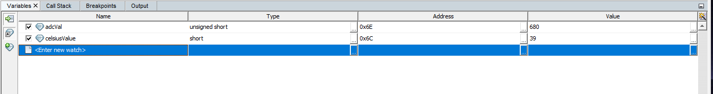

<article class="markdown-body entry-content p-3 p-md-6" itemprop="text">

# PIC18F47Q10 ADCC Internal Temperature Conversion Configuration Example

The PIC18F47Q10 features one 10-bit ADCC module.
In this demo, the ADCC peripheral is used to read a value from the internal temperature sensor. 

## Related Documentation 

- [Getting started with the ADCC tech brief](https://www.microchip.com/DS90003263)
- [PIC18F-Q10 Family Product Page](https://www.microchip.com/design-centers/8-bit/pic-mcus/device-selection/pic18f-q10-product-family)

## Software Used
- MPLAB® X IDE 5.30 or newer [(microchip.com/mplab/mplab-x-ide)](http://www.microchip.com/mplab/mplab-x-ide)
- MPLAB® XC8 2.10 or a newer compiler [(microchip.com/mplab/compilers)](http://www.microchip.com/mplab/compilers)
- MPLAB® Code Configurator (MCC) 3.95.0 or newer [(microchip.com/mplab/mplab-code-configurator)](https://www.microchip.com/mplab/mplab-code-configurator)
- MPLAB® Code Configurator (MCC) Device Libraries PIC10 / PIC12 / PIC16 / PIC18 MCUs [(microchip.com/mplab/mplab-code-configurator)](https://www.microchip.com/mplab/mplab-code-configurator)
- Microchip PIC18F-Q Series Device Support (1.4.109) or newer [(packs.download.microchip.com/)](https://packs.download.microchip.com/)

## Hardware Used
- PIC18F47Q10 Curiosity Nano [(DM182029)](https://www.microchip.com/Developmenttools/ProductDetails/DM182029)

## Setup
The PIC18F47Q10 Curiosity Nano Development Board is used as test platform.

## Operation:
1. Connect the board to the PC.

2. Open the *pic18f47q10-cnano-adcc-temperature-mcc.X* project in MPLAB® X IDE.

3. Set *pic18f47q10-cnano-adcc-temperature-mcc* project as main project. Right click on the project in the *Projects* tab and click *Set as Main Project*:
 

4. Select the *PIC18F47Q10 Curiosity Nano* in the *Hardware Tool* section of the project settings:
  - Right click on the project and click *Properties*;
  - Select the *PIC18F47Q10 Curiosity Nano* (click on the SN) in the *Hardware Tool* tab and then click *OK*:
 

5. Run the code in debug mode: right click on the project and click *Debug*:
 

6. Pause the debug process by clicking the *Pause* button (or click *Debug -> Pause* in the Menu bar):
 

7. Add *celsiusValue* variable to the *Variables window*: right click on the `celsiusValue` variable in main.c file and click *New Watch*:
 

The ADC value of the temperature will be read only once, before the program gets to the infinite loop. The value of `adcVal` will reflect the temperature of the device. The values of `celsiusValue` and `fahrenheitValue` give the temperature in their respective units.
 

## Summary
This project showcases how the Analog-to-Digital Converter with Computation (ADCC) on the new PIC18-Q10 can be used to read the internal temperature of the device.